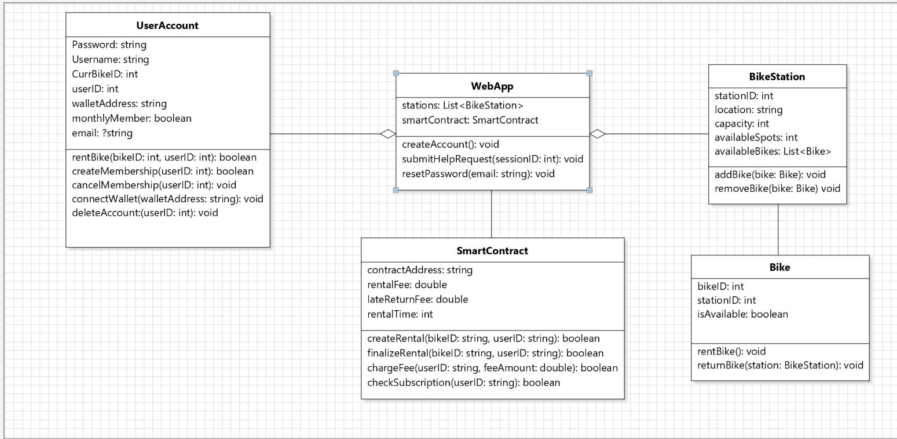

# Milestone 3: Requirements and Design

** Authors **: Pablo Collin, Holden Folk, Antonin Roy, Andrew St-Laurent

## 1. System Purpose and scope

The main purpose of bike sharing systems is to offer a key-in-hand soft-mobility solution to people looking to commute by bike in a metropolitan area. The concept relies on a few of key aspects:
Functional bikes
Affordable
Vast network of stations.
Balanced bike distribution on the network (some occupied and some free docks in each station)
User-friendly bike rental/return protocol

We will aim to achieve all of this without condemning the user to give up unnecessary personal data, which as we saw in deliverable 1, is currently the trade-off we have to resign ourselves to as citizens.

Of course, the first three aspects mentioned are beyond the scope of this project as we will not aim to launch a new bike-sharing system rival to BIXI. Instead, we place ourselves in the position of developers hired by BIXI to rebuild the infrastructure of their system in compliance with the principles of privacy by design. We will hence focus on developing an account management/payment protocol that achieves effective user privacy without excessively degrading the user experience. 

To summarize, the scope of our project will be limited to the following points:
Develop a convenient bike renting/return protocol.
Discourage bike theft (key to maintain an affordable service)
Collect data on the occupation of stations (essential to keep a balanced network)

## 2. Similar Systems
 The following table shows the main differences between our Bixi implementation and some popular bike sharing companies in North America.
 
| Feature                                            | Our Bixi     | Citi Bike NYC | Lime Bike    | Mobi Bikes   |
|----------------------------------------------------|:------------:|:-------------:|:------------:|:------------:|
| No phone number or email needed                    | ✅           | ❌           | ❌           | ❌           |
| No sharing of personal information                 | ✅           | ❌           | ❌           | ❌           |
| No wallet information collected| ✅           | ❌           | ❌           | ❌           |
| No information about browser, computer or mobile device collected | ✅           | ❌           | ❌           | ❌           |
| PIPEDA and law 25 compliance                                  | ✅           | ❌           | ❌           | ✅           |
| Jurisdiction                                       | Canada       | USA          | USA (Many places in the world) | Canada         |

In our comparative analysis of privacy practices among various bike-sharing services, our Bixi emerges as the most privacy-conscious operator. Unlike Citi Bike NYC[^1], Lime Bike[^2], and Mobi Bikes[^3], our Bixi implementation does not require customers to provide a phone number or email address for service usage. Additionally, our Bixi implementation is unique in its commitment to not collecting any personal information from its users, a significant distinction from its competitors. Furthermore, our Bixi version assures that no data regarding the users' devices or browsers is amassed, a standard of privacy not upheld by the other services examined.

In terms of legal compliance with Canadian and Quebecois privacy laws, our Bixi and Mobi Bikes both adhere to the Personal Information Protection and Electronic Documents Act (PIPEDA) as well as to Quebec’s law 25., demonstrating a robust approach to user data protection within Canadian jurisdiction. In contrast, Citi Bike NYC and Lime Bike, both operating under the jurisdiction of the United States, with Lime Bike additionally functioning globally, do not assert compliance with PIPEDA, which is to be expected.

### Different Approaches
We explored two alternative solutions to address our challenge:
-	The first option proposed a one-trip-only system, eliminating the need for user accounts altogether. Users could instantly engage with the app to create a smart contract with any bike without prior registration. However, we opted against this approach due to its lack of membership features, making it less cost-effective for regular users.
-	The second approach introduced a signature-based membership system, still avoiding the need for traditional user accounts. Upon purchasing a membership via a smart contract, users were prompted to provide an electronic signature. Bixi then verified user identity by comparing the provided signature with their database. This system offered the advantage of Bixi tracking user history for up to one month, as signatures changed with each new membership. Nevertheless, we dismissed this system as it posed challenges in user-friendliness when generating individual electronic signatures.

## 3. Functional requirements

### WebApp
-	mobile application 
-	asks you to enable localisation, to provide help searching for bike, but it is not mandatory
 
### User Registration 
-	users can create an account with a username and password
-	users can subscribe to monthly memberships
-	users can ask for support and rectify errors on their past trips up to 1 month 
### Bike 
-   bikes should be docked
-   the only way the bike can be undocked is using a smart contract
-   it should be easy to create a smart contract with a certain bike
### Blockchain Network 
-   the blockchain ensures that Bixi does not have your wallet informations
-   it is a secure way to pay
-   we chose ethereum
### Smart Contract 
-   make the contracts detailed and not overly complicated
-	make the contracts fast and easy for Users
-   make the contracts robust (what if a bike is not docked properly)
-   make contracts easily accessible to owner (see state of the trip)
-	the timestamp of the smart contract calculates the fees
### Payment
-   payment is managed by the smart contract
-   there is a second policy regarding unexpected scenarios to account for smart contract unflexibility

## 4. Privacy Requirements
 
### Data Minimization
-   the database only contains encrypted usernames and passwords
-	Bixi does not have your real name since it does not have access to your wallet information
-	users don’t have to open geolocation data to use the mobile application, but they can for a better service

### Identification / Anonymization
-   it should be impossible for anyone to identify a user looking at the trip Data
-	the best they can do is aggregate the trips you did in your past month
### Data Retention and Discolure
-  	trips contain the userID for 1 month, then the userId is removed making the trip anonymized
-	smart contracts are permanently visible, but they don’t hold personal information
-	by using smart contracts, we remove the 3rd party in charge of your financial transactions, meaning one less party has your wallet informations
-	if Bixi had bad intentions, they could still keep your trip history

### Openness
-	the duration for which your trip is identified is mentionned
	

	

## 5. Stakeholders
 
In the context of our application, stakeholders are identified primarily as the users, the city, and the company. The success of our application is contingent upon the synergistic satisfaction of needs, concerns and requirements of all primary stakeholders. Below is an analysis of each stakeholder category:

Users:
The users are the direct interactors with the application. Their primary interests lie in the utility, usability, efficiency, and reliability of the software. They require a user-friendly interface, quick access to information, and assurance that their data are handled with the utmost security and privacy. The feedback from this demographic is crucial for enhancements and dictates the direction of future development efforts.

The City:
The city, representing the public sector's interests, is a key stakeholder due to its regulatory and facilitative roles. It is concerned with how the application serves the public good, complies with local regulations, promotes sustainable transportation, and integrates with the existing urban infrastructure. The city may also look at the software's impact on traffic, urban planning, and its potential to provide data to support decision-making processes.

The Company:
The company behind the application is the driving force of the system's inception, design, development, and maintenance. Its interests are multifaceted, including achieving business objectives, ensuring a return on investment, maintaining a positive brand image, and fostering customer loyalty. The company must balance profitability with corporate social responsibility and adherence to legal and ethical standards.

Interdependency of Stakeholders:
The users, city, and company are interdependent, with each group's satisfaction contributing to the overall value and viability of the application. User satisfaction can lead to increased adoption rates, which align with the company's commercial goals and the city's objectives for efficient urban mobility solutions. Conversely, the city's support for the application through infrastructure and policy can amplify user adoption and retention, thereby enhancing the company's market position.

## 6. Architectural Design Decisions and Models
 
Our design is a new bike-sharing platform that respects the principles of privacy by design. We will build an application that provides complete anonymity to the user. This application, running on a decentralized blockchain network, will not require any personal identifiers to use at the sacrifice of some minor features.
 
Represented below is the UML class diagram that describes the structure of the application.

 

The UML class diagram outlines how we plan to implement the privacy-centered system. The application will allow users to create an account; however, no personal identifiers will be required to sign up. Instead of the typical payment information stored for credit card transactions, our application looks to make all payments over the blockchain. These privacy improvements ensure complete anonymity while sacrificing minor accessibility to the user.
 
Furthermore, the application will utilize a smart contract to ensure that late/missing bike fees can still be collected through the decentralized system. The application will use Ethereum as the blockchain coin to implement the smart contract and payment. Ethereum already supports decentralized applications and has languages like Solidity for creating smart contracts. 

The user must link an Ethereum wallet to make payments within the application. To facilitate this, we will connect MetaMask with the application to create and ensure proper transactions. 

## 7. Important scenarios

The main scenario that the application will facilitate will be the one-time rental of a bike. We will prompt users to link their Ethereum wallet to their pre-existing account. Next, the user will choose a bike and initiate a smart contract with that specific bike. The appropriate amount is deducted from the user's wallet to start the bike trip. Once the user returns the bike to a station, a response is sent to the smart contract, and the trip terminates. Most of the Ethereum held in the smart contract returns to the user's wallet upon trip completion. 
Here is a sequence diagram representing the process

The application will also include account creation and subscription management. Users will have to create an account using a unique username and password. This account will store no personal information other than an optional email for potential password recovery. The account will save information like trip history and subscription status for user convenience. Even though trip history is stored, no personal information linking users to their trips will be accessible to the application. 

One key application element will be retrieving late and lost bike fees. The application will use a smart contract to retrieve these fees. This contract will withhold a certain amount of currency as collateral until the user terminates the trip by returning their bike. The lost bike fee is only refunded if the trip is terminated after a specific time frame. The fee collection is a limitation on the user as they must pay it before every rental. 

## Bibliography

[^1]: https://www.lyft.com/privacy
[^2]: https://www.li.me/en-co/legal/privacy-policy
[^3]: https://www.mobibikes.ca/en/privacy-policy#:~:text=We%20do%20not%20use%20or,to%20be%20used%20and%20disclosed

