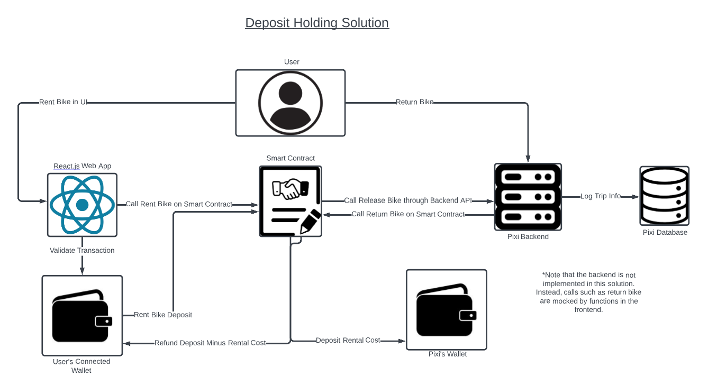

# Smart Contract Bike Rental System

This project was completed for COMP 555 (Software Privacy) and explored an alternative solution to the Bixi bike-sharing service in Montreal that emphasizes privacy by design.

This project utilizes smart contracts and payments on the blockchain to create a pseudo-anonymous payment system that protects user privacy.

This project was created with the help of team members:
Antonin Roy, Pablo Collin, and Andrew St. Laurent.

## Research

The research done before creating the solution is in 'BixiResearch.md'. Here, we explore the privacy concerns with the current Bixi bike rental service.

## Project Structure

This project contains a smart contract project as well as a front end. The front-end project is nested inside the smart contract to facilitate ease of local deployment.

## Solution

The solution utilizes a smart contract payment system to prevent and enforce bike theft while maintaining user anonymity. The user links their wallet to the React.js web app. They initiate a transaction with the smart contract that receives a deposit for the bike. If the user does not return the bike, then the deposit is kept within the contract and not returned to the user.

The owner's wallet is already linked to the Web application. This way, you can register bikes as the owner. However, you can also link your own wallet to see the balance changes that result after transactions. The rent and return features are mocked to buttons on the web app for proof of concept.

The solution is outlined in a diagram below.

